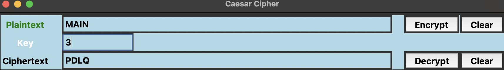

# Caesar Cipher GUI
A simple graphical user interface (GUI) for encrypting and decrypting messages using the Caesar Cipher algorithm.

# Usage

Enter the plaintext message to be encrypted in the "Plaintext" field.

Enter the number of letters to shift in the "Key" field.

Click the "Encrypt" button to encrypt the plaintext message.

The encrypted message will be displayed in the "Ciphertext" field.

To decrypt the message, enter the encrypted message in the "Ciphertext" field and click the "Decrypt" button.

The decrypted message will be displayed in the "Plaintext" field.

Note: Only letters are encrypted and decrypted. Any non-letter characters will remain unchanged.

# Requirements

This program requires Python 3 and the tkinter module to be installed.

# How to run

To run the program, open a terminal or command prompt in the directory where the program is located and type the following command:

# Install

python caesar_cipher_gui.py
